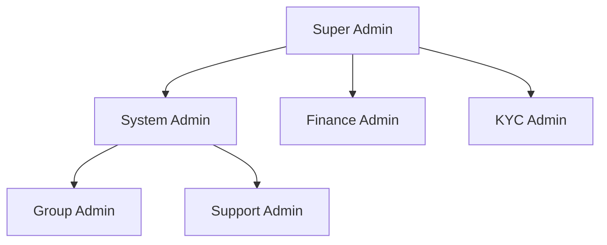

# Admin Panel Architecture - Bharat Samuh Anudan

## Overview
Complete, secure, scalable admin panel with Role-Based Access Control (RBAC) for a digital NGO/group-fund web application.

---

## 1. RBAC Architecture

### 1.1 Admin Role Hierarchy



### 1.2 Role Definitions

| Role | Level | Description |
|------|-------|-------------|
| `super_admin` | 1 | Full system access, can manage other admins |
| `system_admin` | 2 | System configuration, user management, security settings |
| `finance_admin` | 3 | Financial operations, payouts, transaction oversight |
| `kyc_admin` | 4 | KYC verification, document review, compliance |
| `group_admin` | 5 | Group management, member oversight, claim processing |
| `support_admin` | 6 | User support, ticket resolution, basic queries |

### 1.3 Permission Matrix

| Permission | Super | System | Finance | KYC | Group | Support |
|------------|:-----:|:------:|:-------:|:---:|:-----:|:-------:|
| **Users** |||||||
| users.view | ✓ | ✓ | ✓ | ✓ | - | ✓ |
| users.create | ✓ | ✓ | - | - | - | - |
| users.edit | ✓ | ✓ | - | - | - | - |
| users.delete | ✓ | ✓ | - | - | - | - |
| users.manage_roles | ✓ | ✓ | - | - | - | - |
| users.suspend | ✓ | ✓ | - | - | - | ✓ |
| **KYC** |||||||
| kyc.view | ✓ | ✓ | ✓ | ✓ | - | ✓ |
| kyc.verify | ✓ | - | - | ✓ | - | - |
| kyc.reject | ✓ | - | - | ✓ | - | - |
| kyc.request_docs | ✓ | - | - | ✓ | ✓ | - |
| **Groups** |||||||
| groups.view | ✓ | ✓ | ✓ | ✓ | ✓ | ✓ |
| groups.create | ✓ | ✓ | - | - | ✓ | - |
| groups.edit | ✓ | ✓ | - | - | ✓ | - |
| groups.approve | ✓ | ✓ | - | - | ✓ | - |
| groups.delete | ✓ | ✓ | - | - | - | - |
| **Finance** |||||||
| finance.view | ✓ | ✓ | ✓ | - | ✓ | - |
| finance.payouts | ✓ | - | ✓ | - | - | - |
| finance.refunds | ✓ | ✓ | ✓ | - | - | - |
| finance.reports | ✓ | ✓ | ✓ | - | - | - |
| **Claims** |||||||
| claims.view | ✓ | ✓ | ✓ | ✓ | ✓ | ✓ |
| claims.approve | ✓ | ✓ | ✓ | - | ✓ | - |
| claims.reject | ✓ | ✓ | ✓ | - | ✓ | - |
| claims.process_payout | ✓ | - | ✓ | - | - | - |
| **System** |||||||
| system.config | ✓ | ✓ | - | - | - | - |
| system.logs | ✓ | ✓ | - | - | - | - |
| system.backups | ✓ | ✓ | - | - | - | - |
| system.audit | ✓ | ✓ | - | - | - | - |
| **Admin Management** |||||||
| admin.view | ✓ | ✓ | - | - | - | - |
| admin.create | ✓ | - | - | - | - | - |
| admin.edit | ✓ | - | - | - | - | - |
| admin.delete | ✓ | - | - | - | - | - |
| admin.permissions | ✓ | - | - | - | - | - |

---

## 2. Database Schema Extensions

### 2.1 Admin Sessions Table
```sql
CREATE TABLE admin_sessions (
    id UUID PRIMARY KEY DEFAULT uuid_generate_v4(),
    user_id UUID NOT NULL REFERENCES users(id) ON DELETE CASCADE,
    
    -- Session Tokens
    access_token_hash VARCHAR(255) NOT NULL,
    refresh_token_hash VARCHAR(255),
    
    -- Device Info
    device_id VARCHAR(255),
    device_name VARCHAR(200),
    device_type VARCHAR(50), -- desktop, mobile, tablet
    browser VARCHAR(100),
    os VARCHAR(100),
    
    -- Location
    ip_address INET NOT NULL,
    country VARCHAR(100),
    city VARCHAR(100),
    
    -- Session Status
    is_active BOOLEAN DEFAULT TRUE,
    is_revoked BOOLEAN DEFAULT FALSE,
    revoked_at TIMESTAMP WITH TIME ZONE,
    revoked_by UUID REFERENCES users(id),
    revoke_reason VARCHAR(200),
    
    -- Timestamps
    created_at TIMESTAMP WITH TIME ZONE DEFAULT CURRENT_TIMESTAMP,
    expires_at TIMESTAMP WITH TIME ZONE NOT NULL,
    last_activity_at TIMESTAMP WITH TIME ZONE DEFAULT CURRENT_TIMESTAMP,
    
    -- Security
    suspicious_activity BOOLEAN DEFAULT FALSE,
    security_flags JSONB DEFAULT '[]'
);

CREATE INDEX idx_admin_sessions_user ON admin_sessions(user_id);
CREATE INDEX idx_admin_sessions_active ON admin_sessions(user_id, is_active) WHERE is_active = TRUE;
CREATE INDEX idx_admin_sessions_expires ON admin_sessions(expires_at);
```

### 2.2 Permissions Table
```sql
CREATE TABLE permissions (
    id UUID PRIMARY KEY DEFAULT uuid_generate_v4(),
    permission_code VARCHAR(100) UNIQUE NOT NULL,
    permission_name VARCHAR(200) NOT NULL,
    description TEXT,
    resource VARCHAR(50) NOT NULL, -- users, groups, finance, etc.
    action VARCHAR(50) NOT NULL, -- view, create, edit, delete, etc.
    created_at TIMESTAMP WITH TIME ZONE DEFAULT CURRENT_TIMESTAMP
);
```

### 2.3 Role Permissions Table
```sql
CREATE TABLE role_permissions (
    id UUID PRIMARY KEY DEFAULT uuid_generate_v4(),
    role user_role NOT NULL,
    permission_id UUID NOT NULL REFERENCES permissions(id) ON DELETE CASCADE,
    granted_by UUID REFERENCES users(id),
    created_at TIMESTAMP WITH TIME ZONE DEFAULT CURRENT_TIMESTAMP,
    
    UNIQUE(role, permission_id)
);

CREATE INDEX idx_role_permissions_role ON role_permissions(role);
CREATE INDEX idx_role_permissions_permission ON role_permissions(permission_id);
```

### 2.4 Admin Activity Logs Table
```sql
CREATE TABLE admin_activity_logs (
    id UUID PRIMARY KEY DEFAULT uuid_generate_v4(),
    
    -- Actor
    user_id UUID NOT NULL REFERENCES users(id),
    user_role user_role NOT NULL,
    session_id UUID REFERENCES admin_sessions(id),
    
    -- Action
    action_type VARCHAR(50) NOT NULL, -- login, logout, view, create, update, delete, export, etc.
    action_category VARCHAR(50) NOT NULL, -- auth, user, group, finance, system, etc.
    
    -- Target
    entity_type VARCHAR(50),
    entity_id UUID,
    
    -- Details
    description TEXT,
    metadata JSONB DEFAULT '{}',
    changes_summary JSONB, -- before/after for updates
    
    -- Context
    ip_address INET NOT NULL,
    user_agent TEXT,
    device_id VARCHAR(255),
    
    -- Risk Assessment
    risk_score INTEGER DEFAULT 0, -- 0-100
    is_suspicious BOOLEAN DEFAULT FALSE,
    
    created_at TIMESTAMP WITH TIME ZONE DEFAULT CURRENT_TIMESTAMP
);

CREATE INDEX idx_activity_user ON admin_activity_logs(user_id);
CREATE INDEX idx_activity_session ON admin_activity_logs(session_id);
CREATE INDEX idx_activity_action ON admin_activity_logs(action_type, action_category);
CREATE INDEX idx_activity_entity ON admin_activity_logs(entity_type, entity_id);
CREATE INDEX idx_activity_created ON admin_activity_logs(created_at);
CREATE INDEX idx_activity_suspicious ON admin_activity_logs(is_suspicious) WHERE is_suspicious = TRUE;
```

### 2.5 Admin Devices Table
```sql
CREATE TABLE admin_devices (
    id UUID PRIMARY KEY DEFAULT uuid_generate_v4(),
    user_id UUID NOT NULL REFERENCES users(id) ON DELETE CASCADE,
    
    -- Device Info
    device_id VARCHAR(255) UNIQUE NOT NULL,
    device_name VARCHAR(200),
    device_type VARCHAR(50),
    browser VARCHAR(100),
    browser_version VARCHAR(50),
    os VARCHAR(100),
    os_version VARCHAR(50),
    
    -- Trust Status
    is_trusted BOOLEAN DEFAULT FALSE,
    trust_granted_at TIMESTAMP WITH TIME ZONE,
    trust_granted_by UUID REFERENCES users(id),
    
    -- Security
    is_blocked BOOLEAN DEFAULT FALSE,
    blocked_at TIMESTAMP WITH TIME ZONE,
    blocked_reason VARCHAR(200),
    
    -- Usage Stats
    first_seen_at TIMESTAMP WITH TIME ZONE DEFAULT CURRENT_TIMESTAMP,
    last_seen_at TIMESTAMP WITH TIME ZONE DEFAULT CURRENT_TIMESTAMP,
    login_count INTEGER DEFAULT 0,
    
    -- Location History
    last_ip_address INET,
    last_country VARCHAR(100),
    last_city VARCHAR(100)
);

CREATE INDEX idx_admin_devices_user ON admin_devices(user_id);
CREATE INDEX idx_admin_devices_trusted ON admin_devices(user_id, is_trusted) WHERE is_trusted = TRUE;
```

---

## 3. Backend Architecture

### 3.1 Directory Structure
```
backend/src/
├── admin/
│   ├── admin.module.ts
│   ├── controllers/
│   │   ├── admin.controller.ts
│   │   ├── admin-dashboard.controller.ts
│   │   ├── admin-users.controller.ts
│   │   ├── admin-groups.controller.ts
│   │   ├── admin-finance.controller.ts
│   │   ├── admin-claims.controller.ts
│   │   ├── admin-audit.controller.ts
│   │   └── admin-permissions.controller.ts
│   ├── services/
│   │   ├── admin.service.ts
│   │   ├── admin-dashboard.service.ts
│   │   ├── admin-session.service.ts
│   │   ├── admin-activity.service.ts
│   │   ├── permission-matrix.service.ts
│   │   └── audit-log.service.ts
│   ├── guards/
│   │   ├── permissions.guard.ts
│   │   ├── roles.guard.ts
│   │   ├── admin-auth.guard.ts
│   │   └── session-validation.guard.ts
│   ├── decorators/
│   │   ├── require-permissions.decorator.ts
│   │   ├── require-roles.decorator.ts
│   │   ├── current-admin.decorator.ts
│   │   └── audit-log.decorator.ts
│   ├── dto/
│   │   ├── create-admin.dto.ts
│   │   ├── update-admin.dto.ts
│   │   ├── list-admins.dto.ts
│   │   ├── admin-session.dto.ts
│   │   ├── activity-log-query.dto.ts
│   │   └── audit-query.dto.ts
│   ├── entities/
│   │   ├── admin-session.entity.ts
│   │   ├── permission.entity.ts
│   │   ├── role-permission.entity.ts
│   │   ├── admin-activity.entity.ts
│   │   └── admin-device.entity.ts
│   └── constants/
│       ├── permissions.enum.ts
│       └── admin-roles.enum.ts
```

### 3.2 Core Services

#### PermissionMatrixService
```typescript
interface PermissionCheckOptions {
  userId: string;
  userRole: AdminRole;
  permission: Permission;
  resourceId?: string;
  context?: Record<string, any>;
}

class PermissionMatrixService {
  async hasPermission(options: PermissionCheckOptions): Promise<boolean>;
  async getUserPermissions(userId: string): Promise<Permission[]>;
  async validatePermissionOrThrow(options: PermissionCheckOptions): Promise<void>;
  async getPermissionsForRole(role: AdminRole): Promise<Permission[]>;
  async assignPermission(role: AdminRole, permission: Permission, grantedBy: string): Promise<void>;
  async revokePermission(role: AdminRole, permission: Permission): Promise<void>;
}
```

#### AdminSessionService
```typescript
interface SessionConfig {
  maxConcurrentSessions: number;
  sessionTimeoutMinutes: number;
  absoluteTimeoutHours: number;
  requireTrustedDevice: boolean;
}

class AdminSessionService {
  async createSession(userId: string, deviceInfo: DeviceInfo, ipAddress: string): Promise<AdminSession>;
  async validateSession(sessionId: string, token: string): Promise<boolean>;
  async refreshSession(sessionId: string, refreshToken: string): Promise<TokenPair>;
  async revokeSession(sessionId: string, reason: string, revokedBy?: string): Promise<void>;
  async revokeAllUserSessions(userId: string, reason: string): Promise<void>;
  async getActiveSessions(userId: string): Promise<AdminSession[]>;
  async updateLastActivity(sessionId: string): Promise<void>;
  async checkConcurrentSessionLimit(userId: string): Promise<boolean>;
}
```

#### AdminActivityService
```typescript
interface ActivityLogEntry {
  userId: string;
  userRole: AdminRole;
  sessionId?: string;
  actionType: ActivityActionType;
  actionCategory: ActivityCategory;
  entityType?: string;
  entityId?: string;
  description: string;
  metadata?: Record<string, any>;
  ipAddress: string;
  userAgent: string;
  deviceId?: string;
  riskScore?: number;
}

class AdminActivityService {
  async logActivity(entry: ActivityLogEntry): Promise<void>;
  async getActivityLogs(query: ActivityQuery): Promise<PaginatedResult<ActivityLog>>;
  async getSuspiciousActivities(filters: SuspiciousActivityFilters): Promise<ActivityLog[]>;
  async calculateRiskScore(entry: Partial<ActivityLogEntry>): Promise<number>;
  async exportActivityLogs(filters: ExportFilters): Promise<Buffer>;
}
```

---

## 4. Frontend Architecture

### 4.1 Directory Structure
```
src/
├── admin/
│   ├── AdminModule.tsx
│   ├── components/
│   │   ├── layout/
│   │   │   ├── AdminLayout.tsx
│   │   │   ├── AdminSidebar.tsx
│   │   │   ├── AdminHeader.tsx
│   │   │   └── AdminFooter.tsx
│   │   ├── dashboard/
│   │   │   ├── AdminStatsGrid.tsx
│   │   │   ├── AdminActivityChart.tsx
│   │   │   ├── PendingApprovalsWidget.tsx
│   │   │   └── QuickActionsPanel.tsx
│   │   ├── users/
│   │   │   ├── UserManagementTable.tsx
│   │   │   ├── UserDetailModal.tsx
│   │   │   ├── RoleAssignmentForm.tsx
│   │   │   └── UserActivityTimeline.tsx
│   │   ├── permissions/
│   │   │   ├── PermissionMatrix.tsx
│   │   │   ├── RoleEditor.tsx
│   │   │   └── PermissionChecker.tsx
│   │   ├── audit/
│   │   │   ├── AuditLogTable.tsx
│   │   │   ├── AuditLogFilters.tsx
│   │   │   ├── AuditDetailModal.tsx
│   │   │   └── ActivityHeatmap.tsx
│   │   └── sessions/
│   │       ├── SessionManager.tsx
│   │       ├── DeviceList.tsx
│   │       └── SecuritySettings.tsx
│   ├── hooks/
│   │   ├── usePermissions.ts
│   │   ├── useAdminAuth.ts
│   │   ├── useAdminSession.ts
│   │   ├── useActivityLog.ts
│   │   └── useAuditLog.ts
│   ├── contexts/
│   │   ├── AdminAuthContext.tsx
│   │   └── PermissionsContext.tsx
│   ├── guards/
│   │   ├── PermissionGate.tsx
│   │   ├── RoleGate.tsx
│   │   └── AdminRouteGuard.tsx
│   ├── services/
│   │   ├── admin-api.service.ts
│   │   ├── admin-session.service.ts
│   │   ├── permission.service.ts
│   │   └── audit.service.ts
│   └── types/
│       ├── admin.types.ts
│       ├── permissions.types.ts
│       └── audit.types.ts
```

### 4.2 Permission Hooks & Components

#### usePermissions Hook
```typescript
interface UsePermissionsReturn {
  permissions: Permission[];
  hasPermission: (permission: Permission) => boolean;
  hasAnyPermission: (permissions: Permission[]) => boolean;
  hasAllPermissions: (permissions: Permission[]) => boolean;
  isLoading: boolean;
  refresh: () => Promise<void>;
}

function usePermissions(): UsePermissionsReturn;
```

#### PermissionGate Component
```typescript
interface PermissionGateProps {
  permission: Permission | Permission[];
  requireAll?: boolean;
  fallback?: React.ReactNode;
  children: React.ReactNode;
}

function PermissionGate(props: PermissionGateProps): JSX.Element;
```

#### RoleGate Component
```typescript
interface RoleGateProps {
  roles: AdminRole | AdminRole[];
  requireAll?: boolean;
  fallback?: React.ReactNode;
  children: React.ReactNode;
}

function RoleGate(props: RoleGateProps): JSX.Element;
```

---

## 5. API Endpoints

### 5.1 Admin Dashboard
```
GET   /api/admin/dashboard/stats          - Get dashboard statistics
GET   /api/admin/dashboard/activity         - Get recent admin activity
GET   /api/admin/dashboard/pending          - Get pending approvals count
GET   /api/admin/dashboard/alerts           - Get system alerts
```

### 5.2 User Management
```
GET    /api/admin/users                     - List all users
POST   /api/admin/users                     - Create new user
GET    /api/admin/users/:id                 - Get user details
PUT    /api/admin/users/:id                 - Update user
DELETE /api/admin/users/:id                 - Delete user
PUT    /api/admin/users/:id/role            - Update user role
PUT    /api/admin/users/:id/status          - Update user status
GET    /api/admin/users/:id/activity        - Get user activity
GET    /api/admin/users/:id/sessions        - Get user sessions
```

### 5.3 Admin Management
```
GET    /api/admin/admins                    - List all admins
POST   /api/admin/admins                    - Create new admin
GET    /api/admin/admins/:id                - Get admin details
PUT    /api/admin/admins/:id                - Update admin
DELETE /api/admin/admins/:id                - Delete admin
GET    /api/admin/admins/:id/permissions    - Get admin permissions
PUT    /api/admin/admins/:id/permissions    - Update admin permissions
```

### 5.4 Group Management
```
GET    /api/admin/groups                    - List all groups
GET    /api/admin/groups/:id                - Get group details
PUT    /api/admin/groups/:id/approve        - Approve group
PUT    /api/admin/groups/:id/reject         - Reject group
PUT    /api/admin/groups/:id/suspend        - Suspend group
GET    /api/admin/groups/:id/members        - Get group members
GET    /api/admin/groups/:id/transactions   - Get group transactions
```

### 5.5 Finance Management
```
GET    /api/admin/finance/transactions      - List all transactions
GET    /api/admin/finance/payouts           - List pending payouts
POST   /api/admin/finance/payouts/:id       - Process payout
GET    /api/admin/finance/reports           - Get financial reports
POST   /api/admin/finance/refunds           - Process refund
```

### 5.6 Claims Management
```
GET    /api/admin/claims                    - List all claims
GET    /api/admin/claims/:id                - Get claim details
PUT    /api/admin/claims/:id/approve        - Approve claim
PUT    /api/admin/claims/:id/reject         - Reject claim
POST   /api/admin/claims/:id/payout         - Process claim payout
```

### 5.7 Audit & Activity
```
GET    /api/admin/audit/logs                - Get audit logs
GET    /api/admin/audit/activity            - Get activity logs
GET    /api/admin/audit/sessions            - Get session logs
GET    /api/admin/audit/export              - Export audit data
GET    /api/admin/audit/stats               - Get audit statistics
```

### 5.8 Session Management
```
GET    /api/admin/sessions                  - Get active sessions
DELETE /api/admin/sessions/:id              - Revoke session
DELETE /api/admin/sessions/user/:userId     - Revoke all user sessions
GET    /api/admin/sessions/devices          - Get trusted devices
PUT    /api/admin/sessions/devices/:id      - Update device trust
```

### 5.9 Permissions Management
```
GET    /api/admin/permissions               - List all permissions
GET    /api/admin/permissions/roles         - Get role-permission matrix
PUT    /api/admin/permissions/roles/:role   - Update role permissions
GET    /api/admin/permissions/check         - Check specific permission
```

---

## 6. Security Implementation

### 6.1 Session Security
- **Token Rotation**: Access tokens expire every 15 minutes, refresh every 7 days
- **Concurrent Session Limit**: Max 3 active sessions per admin
- **Absolute Timeout**: Force logout after 8 hours regardless of activity
- **Idle Timeout**: Logout after 30 minutes of inactivity
- **Device Fingerprinting**: Track and validate device characteristics
- **IP-based Alerts**: Notify on login from new location

### 6.2 Permission Security
- **Server-side validation**: Always verify permissions on server
- **Defense in depth**: Guards at controller, service, and database levels
- **Permission caching**: Cache permissions for 5 minutes, invalidate on change
- **Audit all permission checks**: Log denied access attempts

### 6.3 Activity Logging
- **Comprehensive logging**: All actions logged with context
- **Immutable logs**: Logs cannot be modified or deleted
- **Real-time alerts**: Notify on suspicious activity
- **Retention policy**: Keep logs for 2 years
- **Export capability**: Export logs for compliance

### 6.4 Data Protection
- **Field-level encryption**: Encrypt sensitive admin data
- **Pseudonymization**: Mask user data in logs
- **Access controls**: Row-level security for sensitive data
- **Rate limiting**: Prevent brute force on admin endpoints

---

## 7. UI/UX Design

### 7.1 Admin Dashboard Layout
```
┌─────────────────────────────────────────────────────────────┐
│  Logo                    Notifications   Admin User  [Menu] │
├──────────┬──────────────────────────────────────────────────┤
│          │                                                  │
│ Dashboard│   Dashboard Stats Cards                          │
│ Users    │   ┌────────┐ ┌────────┐ ┌────────┐ ┌────────┐   │
│ Groups   │   │ Users  │ │ Groups │ │ Funds  │ │ Claims │   │
│ Finance  │   │  1,234 │ │   567  │ │₹45.2L │ │   23   │   │
│ Claims   │   └────────┘ └────────┘ └────────┘ └────────┘   │
│ KYC      │                                                  │
│ Audit    │   ┌─────────────────┐ ┌──────────────────────┐  │
│ Settings │   │ Pending         │ │ Recent Activity      │  │
│          │   │ Approvals       │ │                      │  │
│          │   │                 │ │ • User created       │  │
│          │   │ • 5 KYC pending │ │ • Claim approved     │  │
│          │   │ • 3 Groups      │ │ • Group approved     │  │
│          │   └─────────────────┘ └──────────────────────┘  │
│          │                                                  │
└──────────┴──────────────────────────────────────────────────┘
```

### 7.2 Permission Matrix UI
```
┌────────────────────────────────────────────────────────────┐
│ Permission Matrix                                          │
├──────────────────┬─────────┬────────┬───────┬─────────────┤
│ Permission       │Super    │System  │Finance│Group Admin  │
├──────────────────┼─────────┼────────┼───────┼─────────────┤
│ Users            │         │        │       │             │
│   View           │    ✓    │   ✓    │   ✓   │      ✓      │
│   Create         │    ✓    │   ✓    │   -   │      -      │
│   Edit           │    ✓    │   ✓    │   -   │      -      │
│   Delete         │    ✓    │   ✓    │   -   │      -      │
├──────────────────┼─────────┼────────┼───────┼─────────────┤
│ Groups           │         │        │       │             │
│   View           │    ✓    │   ✓    │   ✓   │      ✓      │
│   Approve        │    ✓    │   ✓    │   -   │      ✓      │
├──────────────────┼─────────┼────────┼───────┼─────────────┤
│ [Save Changes]                                          │
└────────────────────────────────────────────────────────────┘
```

---

## 8. Implementation Phases

### Phase 1: Foundation (Week 1)
- Database schema extensions
- Core permission and session services
- Basic RBAC guards

### Phase 2: Backend APIs (Week 2)
- Admin dashboard APIs
- User management APIs
- Permission management APIs
- Session management APIs

### Phase 3: Frontend Core (Week 3)
- Admin layout and navigation
- Permission hooks and guards
- Dashboard components
- User management UI

### Phase 4: Advanced Features (Week 4)
- Audit log viewer
- Session manager
- Activity monitoring
- Security settings

### Phase 5: Polish & Security (Week 5)
- Rate limiting
- Additional security hardening
- Testing
- Documentation

---

## 9. Testing Strategy

### 9.1 Unit Tests
- Permission matrix calculations
- Session validation logic
- Activity logging
- Guard behavior

### 9.2 Integration Tests
- API endpoint access control
- Database trigger behavior
- Session lifecycle
- Permission cache invalidation

### 9.3 E2E Tests
- Complete admin workflows
- Permission-based UI hiding
- Session timeout behavior
- Audit log accuracy

---

## 10. Deployment Checklist

- [ ] Database migrations applied
- [ ] Seed permissions data
- [ ] Configure session timeouts
- [ ] Set up log rotation
- [ ] Configure rate limiting
- [ ] Enable audit logging
- [ ] Set up monitoring alerts
- [ ] Create initial super admin
- [ ] Document emergency access
- [ ] Test backup/restore